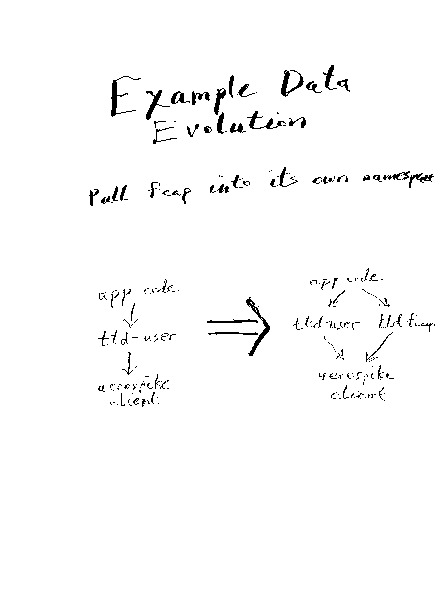
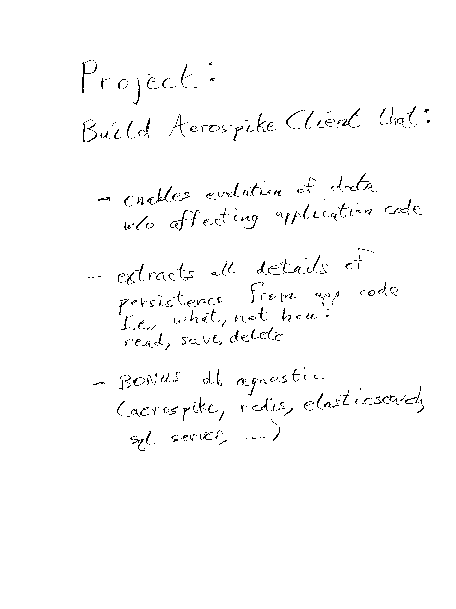
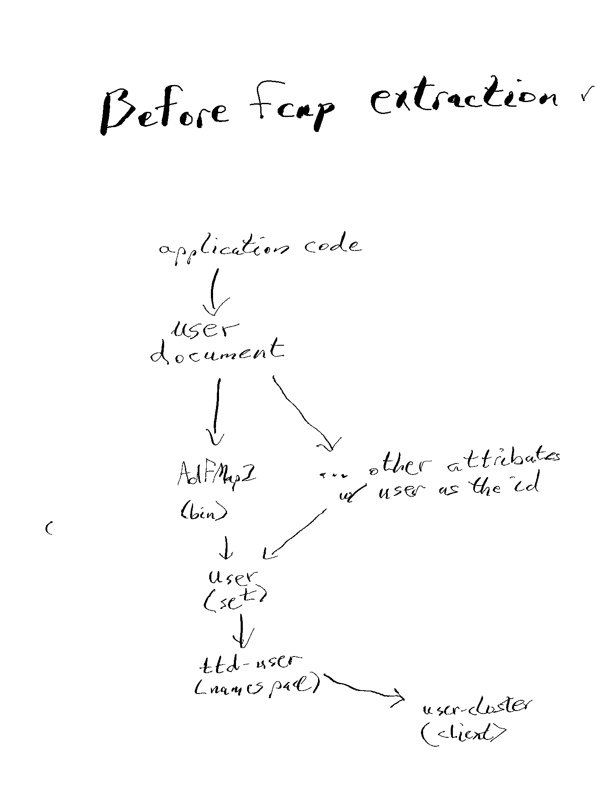
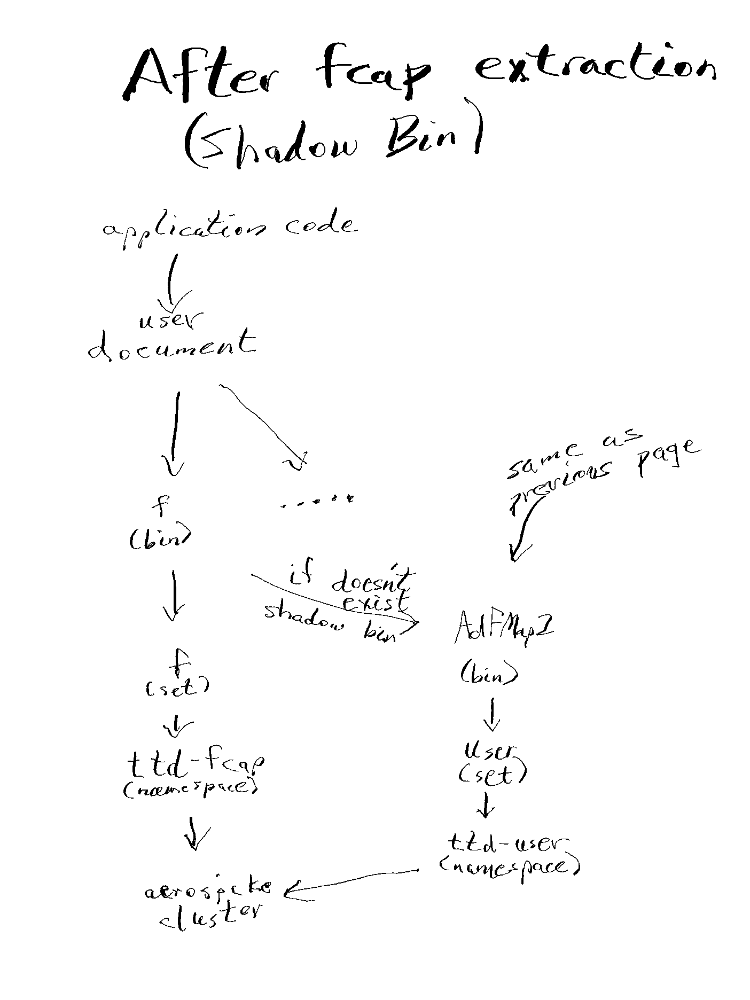
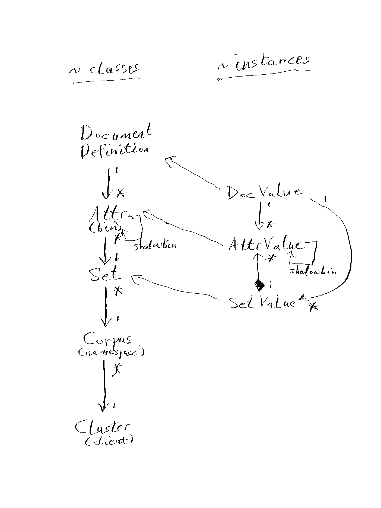

# Sample Application

## Setup

First you'll want to set up a local Aerospike database with at least ttd-user and
ttd-fcap namespaces. Running `./db-setup.sh` will clear records with id=1 in ttd-user
and ttd-fcap, and add a single record to ttd-user. db-setup.sh calls db-show.sh to
show what is currently in the database, and it may be run independently with `./db-show.sh`

## Sample Application

The sample application is `shadow-application.rb`.

It has two methods which mimics how a much larger application might be written:

- A setup method which, in the sample app, returns an interface to a document
with a user id as the key. The attributes of the document might all come from
a single Aerospike database, or might be merged from multiple databases (Aerospike,
Redis, SQL Server, Elasticsearch, etc.) with the same user id key.
The sample app names this method `build_user_document_template`, and will be
described further below.

- A application execution method (often called "main" in some languages).
The sample app names this method `application_code`, and is the smallest possible
app that can demonstrate shadow bins! It reads a user document and prints it to the
screen, updates a single field, prints the record again to show the field has changed,
and then saves the user document.

At the bottom of the file, these two methods are called.

## Running the Sample Application

1. `./db-setup.sh` prepares the database to an initial state.
2. `./shadow-application.rb` updates the database.
3. `./db-show.sh` shows the database has been changed to mimic the in-memory record.

4. In shadow-application.rb, change `false` to `true` in the buil_user_document_template
method.
5. `./db-setup.sh` prepares the database to an initial state. The record will be
completely contained in ttd-user.
6. `./shadow-application.rb` forms the user document to be in both ttd-user and ttd-fcap namespaces instead of just the original ttd-user namespace.
7. `./db-show.sh` shows the database has been changed to mimic the in-memory record. The
user document will now be spread across the two namespaces

How does this work? When `fmap` is requested from the user document, it looks in the
ttd-fcap record but finds the record doesn't exist, so it looks at its shadow bin,
which is in ttd-user and finds it does exist there, so it pulls that data into
the top level bin (out of the shadow bin). When the user document is saved,
it saves all the top level bins.

Note that for data that has evolved many times, the might be nested shadow bins,
but the data won't be read from the nested namespaces unless the higher level
bin was empty.

## Reference Implementation

The library is shadow_bin.rb.

---
---
---

---
---
---

---
---
---

---
---
---

